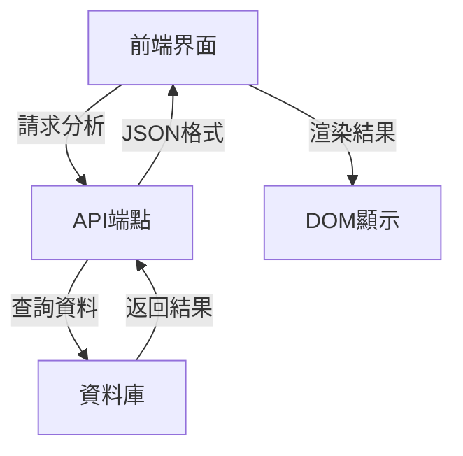

# 紫微斗數四化星分析功能開發計畫

## 功能概述
- 實現紫微斗數四化星(化祿/化權/化科/化忌)分析功能
- 與現有「命宮與福德宮主星分析」功能保持相同架構
- 提供多宮位組合分析能力

## 技術架構



## 後端實現

### API設計
- 端點: `/api/sihua-analysis`
- 請求方法: POST
- 參數:
  - `birth_data`: 生辰資料
  - `palace`: 指定宮位(可選)
- 回應格式:
```json
{
  "status": "success",
  "data": {
    "hua_lu": [...],
    "hua_quan": [...], 
    "hua_ke": [...],
    "hua_ji": [...]
  }
}
```

### 資料來源
- 使用現有 `sihua_stars` 資料表
- 需確認資料遷移腳本: `tc/DB/migrate_sihua_stars.sql`

## 前端實現

### 顯示位置
- 對應 `index.html` 中「B. 四化星分析」區塊
- 參考現有命宮分析DOM結構

### 主要功能
1. 非同步獲取分析結果(fetch API)
2. 動態渲染四化星分析表格
3. 宮位選擇器交互
4. 錯誤處理與載入狀態

## 測試方案

### 單元測試
- API端點測試
- 資料驗證測試
- 邊界條件測試

### 整合測試
- 前端渲染測試
- 用戶交互測試
- 跨瀏覽器兼容性測試

## 開發時程
| 階段 | 預計工時 | 交付物 |
|------|---------|--------|
| API開發 | 8h | 可運作端點 |
| 前端整合 | 6h | 完整UI功能 |
| 測試調整 | 4h | 測試報告 |
| 總計 | 18h | 可交付功能 |

## 風險管理
- 資料一致性問題
- 前端性能優化
- 跨裝置兼容性